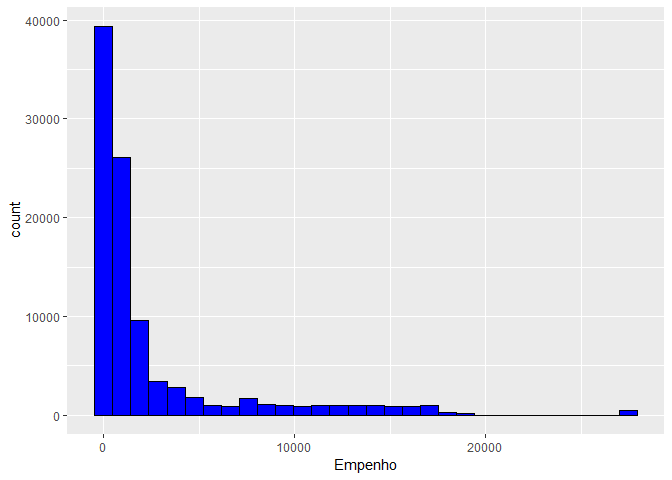
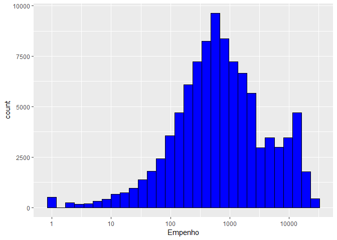

Projeto 1: Execução Orçamentária
================

<!-- -->

  - Fonte: [Portal de Transparência
    Fiscal](http://www.transparencia.rj.gov.br/transparencia/faces/OrcamentoTematico/despesa)
  - Estudo exploratório:
      - Quais “pastas” estão sendo mais pagas
      - Quais modalidades de licitação
      - Com qual frequência de dispensa
      - Por áreas de governo, etc.
  - Pasta de Saúde:
      - Esta pasta recebe menos recursos do que as demais
      - Comparar com gastos em outras áreas

# Preparo dos Dados

Inclusão de pacotes

``` r
library(tidyverse)
library(fs)
```

Lista diretório

``` r
dir_ls("data")
```

    ## data/despesa.zip              data/despesa2018.csv          
    ## data/despesa2018.zip          data/despesa2018_squished.csv 
    ## data/despesa2018_squished.zip

Unzipa o original

``` r
unzip("data/despesa2018.zip",exdir='data')
```

Cria variável com nome do arquivo e conta linhas

``` r
fname_2018 <- "data/despesa2018.csv"
linhas <- read_file(fname_2018) %>% str_count('\\n')
linhas
```

    ## [1] 99368

Olhar para as primeiras
    linhas

``` r
read_lines(fname_2018, n_max=10)
```

    ##  [1] "Governo do Estado do Rio de Janeiro"                                                                                                                                                                                                                                                                                                                                                                                                                                                                                                                                                                                                                                                                                                                                                                                                                                                                                                                                                                                                                                                                                                                                                                                                                                                                                                                                                                                                                                                                                                                                                                                                                                                                                                                                                                                                                                                                                                                                                                                                                                                                                                                                                                                                                                                                                                                                                                                                                                                                                                                                                                                                                                                                                                                                                                                                                                                                                                                                                                                                                                                                                                                                                                                                                                                                           
    ##  [2] "Secretaria de Estado de Fazenda"                                                                                                                                                                                                                                                                                                                                                                                                                                                                                                                                                                                                                                                                                                                                                                                                                                                                                                                                                                                                                                                                                                                                                                                                                                                                                                                                                                                                                                                                                                                                                                                                                                                                                                                                                                                                                                                                                                                                                                                                                                                                                                                                                                                                                                                                                                                                                                                                                                                                                                                                                                                                                                                                                                                                                                                                                                                                                                                                                                                                                                                                                                                                                                                                                                                                               
    ##  [3] "Subsecretaria de Pol<ed>tica Fiscal"                                                                                                                                                                                                                                                                                                                                                                                                                                                                                                                                                                                                                                                                                                                                                                                                                                                                                                                                                                                                                                                                                                                                                                                                                                                                                                                                                                                                                                                                                                                                                                                                                                                                                                                                                                                                                                                                                                                                                                                                                                                                                                                                                                                                                                                                                                                                                                                                                                                                                                                                                                                                                                                                                                                                                                                                                                                                                                                                                                                                                                                                                                                                                                                                                                                                           
    ##  [4] "Transpar<ea>ncia Fiscal"                                                                                                                                                                                                                                                                                                                                                                                                                                                                                                                                                                                                                                                                                                                                                                                                                                                                                                                                                                                                                                                                                                                                                                                                                                                                                                                                                                                                                                                                                                                                                                                                                                                                                                                                                                                                                                                                                                                                                                                                                                                                                                                                                                                                                                                                                                                                                                                                                                                                                                                                                                                                                                                                                                                                                                                                                                                                                                                                                                                                                                                                                                                                                                                                                                                                                       
    ##  [5] "Despesa entre 01/01/2018 e 31/12/2018"                                                                                                                                                                                                                                                                                                                                                                                                                                                                                                                                                                                                                                                                                                                                                                                                                                                                                                                                                                                                                                                                                                                                                                                                                                                                                                                                                                                                                                                                                                                                                                                                                                                                                                                                                                                                                                                                                                                                                                                                                                                                                                                                                                                                                                                                                                                                                                                                                                                                                                                                                                                                                                                                                                                                                                                                                                                                                                                                                                                                                                                                                                                                                                                                                                                                         
    ##  [6] "Poder     ;Nome Poder          ;Grupo               ;Nome Grupo          ;Modalidade de Aplica<e7><e3>o       ;Nome Modalidade de Aplica<e7><e3>o  ;Elemento            ;Nome Elemento       ;Sub Elemento        ;Nome Sub Elemento   ;<d3>rg<e3>o               ;Nome <d3>rg<e3>o          ;UO                  ;Nome UO                       ;UG                  ;Nome UG                       ;Credor              ;Nome Credor         ;Fonte de Recursos             ;Nome Fonte de Recursos        ;Processo                      ;Fun<e7><e3>o              ;Nome Fun<e7><e3>o         ;Sub Fun<e7><e3>o          ;Nome Sub Fun<e7><e3>o     ;Licita<e7><e3>o                     ;Nome Licita<e7><e3>o                ;Empenho             ;Hist<f3>rico           ;Valor Empenhado     ;Valor Liquidado     ;Valor Pago          "                                                                                                                                                                                                                                                                                                                                                                                                                                                                                                                                                                                                                                                                                                                                                                                                                                                                                                                                                                                                                                                                                                                                                                                                                                                                                                                                                                                                                                                                                                                                                                                                                                                                                                                                                                                                                                                                                                                                                                                                                                                                                                                                                                                                                                                                                                                                                                                                                                                                
    ##  [7] "1         ;Executivo                                                                       ;3     ;;90    ;Aplica<e7><f5>es Diretas                                                              ;339036;Outros Servi<e7>os de Terceiros - Pessoa F<ed>sica                                    ;;;21    ;Secretaria de Estado da Casa Civil e Desenvol                                   ;2133  ;Departamento de Tr<e2>nsito do Estado do Rio de                                    ;263100;DEPARTAMENTO DE TRANSITO DO RIO DE JANEIRO                                      ;965.197.977-15;ALEXANDRE CESAR DE SOUZA                                                        ;32    ;Taxas pelo Exerc<ed>cio do Poder de Pol<ed>cia e por Servi<e7>os P<fa>blicos                ;E-12/061/7244/20                                                                ;06    ;Seguran<e7>a P<fa>blica                                                               ;122   ;Administra<e7><e3>o Geral                                                             ;05    ;DISPENSA                                                                        ;4390                ;Cancelamento conforme Decreto n<U+00BA>46.139/2017.                                                                                                                                                                                                                                                                                                                                                                                                                                                                                                                                                                                                                                                                                                                                                                                                                                                                                                                                                                                                                                                                                                                                                                                                                                                                                                                                                                                                                                                                                                                                                                                                                                                                                                                                                                                                                                                                                                                                                                                                                                    ;0               ;0               ;0               "
    ##  [8] "1         ;Executivo                                                                       ;3     ;;90    ;Aplica<e7><f5>es Diretas                                                              ;339014;Di<e1>rias - Civil                                                                 ;;;31    ;Secretaria de Estado de Transportes                                             ;3131  ;Instituto de Pesos e Medidas do Estado do Rio                                   ;053100;INSTITUTO DE PESOS E MEDIDAS DO RJ                                              ;042.670.427-48;LUIS ALEXANDRE FERREIRA SILVEIRA                                                ;12    ;Transfer<ea>ncias Volunt<e1>rias                                                      ;E-12/171/1022/17                                                                ;22    ;Ind<fa>stria                                                                       ;122   ;Administra<e7><e3>o Geral                                                             ;07    ;NAO APLICAVEL                                                                   ;1354                ;Empenho para pagamento de di<e1>rias.                                                                                                                                                                                                                                                                                                                                                                                                                                                                                                                                                                                                                                                                                                                                                                                                                                                                                                                                                                                                                                                                                                                                                                                                                                                                                                                                                                                                                                                                                                                                                                                                                                                                                                                                                                                                                                                                                                                                                                                                                                              ;0               ;0               ;0               "            
    ##  [9] "1         ;Executivo                                                                       ;3     ;;90    ;Aplica<e7><f5>es Diretas                                                              ;339039;Outros Servi<e7>os de Terceiros - Pessoa Jur<ed>dic                                   ;;;29    ;Secretaria de Estado de Sa<fa>de                                                   ;2961  ;Fundo Estadual de Sa<fa>de                                                         ;296100;FUNDO ESTADUAL DE SAUDE - FES                                                   ;40.197.840/000;BRASIL SUL IND E COM LTDA                                                       ;22    ;Adicional do ICMS - FECP                                                        ;E-08-001/1193 /2                                                                ;10    ;Sa<fa>de                                                                           ;302   ;Assist<ea>ncia Hospitalar e Ambulatorial                                           ;09    ;PREG<c3>O ELETR<d4>NICO                                                               ;7927                ;Decreto 46139 de 30 de outubro de 2017                                                                                                                                                                                                                                                                                                                                                                                                                                                                                                                                                                                                                                                                                                                                                                                                                                                                                                                                                                                                                                                                                                                                                                                                                                                                                                                                                                                                                                                                                                                                                                                                                                                                                                                                                                                                                                                                                                                                                                                                                                          ;0               ;0               ;0               "         
    ## [10] "1         ;Executivo                                                                       ;3     ;;90    ;Aplica<e7><f5>es Diretas                                                              ;339030;Material de Consumo                                                             ;;;21    ;Secretaria de Estado da Casa Civil e Desenvol                                   ;2104  ;Subsecretaria de Estado de Governo                                              ;120200;SUBSEC. DE REC. LOGISTICOS - SEFAZ-LOGISTICA                                    ;34.274.233/000;PETROBRAS DISTRIBUIDORA S/A                                                     ;00    ;Ordin<e1>rios Provenientes de Impostos                                             ;E-01/036/649/201                                                                ;04    ;Administra<e7><e3>o                                                                   ;122   ;Administra<e7><e3>o Geral                                                             ;09    ;PREG<c3>O ELETR<d4>NICO                                                               ;561                 ;SEGOV  CANCFELAMENTO DE EMPENHO                                                                                                                                                                                                                                                                                                                                                                                                                                                                                                                                                                                                                                                                                                                                                                                                                                                                                                                                                                                                                                                                                                                                                                                                                                                                                                                                                                                                                                                                                                                                                                                                                                                                                                                                                                                                                                                                                                                                                                                                                                                 ;0               ;0               ;0               "

Qual é o encoding deste arquivo?

``` r
guess_encoding(fname_2018)
```

    ## # A tibble: 2 x 2
    ##   encoding   confidence
    ##   <chr>           <dbl>
    ## 1 ISO-8859-1       0.8 
    ## 2 ISO-8859-2       0.35

Data Cleansing: Pular 5 linhas no cabeçalho, ajustar o “encoding”

``` r
loc_bz <- locale(encoding="ISO-8859-1")
primeiras_linhas <- read_lines(fname_2018, # .zip
                               skip=5,n_max=5,
                               locale=loc_bz)
primeiras_linhas
```

    ## [1] "Poder     ;Nome Poder          ;Grupo               ;Nome Grupo          ;Modalidade de Aplicação       ;Nome Modalidade de Aplicação  ;Elemento            ;Nome Elemento       ;Sub Elemento        ;Nome Sub Elemento   ;Órgão               ;Nome Órgão          ;UO                  ;Nome UO                       ;UG                  ;Nome UG                       ;Credor              ;Nome Credor         ;Fonte de Recursos             ;Nome Fonte de Recursos        ;Processo                      ;Função              ;Nome Função         ;Sub Função          ;Nome Sub Função     ;Licitação                     ;Nome Licitação                ;Empenho             ;Histórico           ;Valor Empenhado     ;Valor Liquidado     ;Valor Pago          "                                                                                                                                                                                                                                                                                                                                                                                                                                                                                                                                                                                                                                                                                                                                                                                                                                                                                                                                                                                                                                                                                                                                                                                                                                                                                                                                                                                                                                                                                                                                                                                                                                                                                                                                                                                                                                                                                                                                                                                                                                                                                                                                                                                                                                                                                                                                                                                                                                                                                        
    ## [2] "1         ;Executivo                                                                       ;3     ;;90    ;Aplicações Diretas                                                              ;339036;Outros Serviços de Terceiros - Pessoa Física                                    ;;;21    ;Secretaria de Estado da Casa Civil e Desenvol                                   ;2133  ;Departamento de Trânsito do Estado do Rio de                                    ;263100;DEPARTAMENTO DE TRANSITO DO RIO DE JANEIRO                                      ;965.197.977-15;ALEXANDRE CESAR DE SOUZA                                                        ;32    ;Taxas pelo Exercício do Poder de Polícia e por Serviços Públicos                ;E-12/061/7244/20                                                                ;06    ;Segurança Pública                                                               ;122   ;Administração Geral                                                             ;05    ;DISPENSA                                                                        ;4390                ;Cancelamento conforme Decreto nº46.139/2017.                                                                                                                                                                                                                                                                                                                                                                                                                                                                                                                                                                                                                                                                                                                                                                                                                                                                                                                                                                                                                                                                                                                                                                                                                                                                                                                                                                                                                                                                                                                                                                                                                                                                                                                                                                                                                                                                                                                                                                                                                                    ;0               ;0               ;0               "
    ## [3] "1         ;Executivo                                                                       ;3     ;;90    ;Aplicações Diretas                                                              ;339014;Diárias - Civil                                                                 ;;;31    ;Secretaria de Estado de Transportes                                             ;3131  ;Instituto de Pesos e Medidas do Estado do Rio                                   ;053100;INSTITUTO DE PESOS E MEDIDAS DO RJ                                              ;042.670.427-48;LUIS ALEXANDRE FERREIRA SILVEIRA                                                ;12    ;Transferências Voluntárias                                                      ;E-12/171/1022/17                                                                ;22    ;Indústria                                                                       ;122   ;Administração Geral                                                             ;07    ;NAO APLICAVEL                                                                   ;1354                ;Empenho para pagamento de diárias.                                                                                                                                                                                                                                                                                                                                                                                                                                                                                                                                                                                                                                                                                                                                                                                                                                                                                                                                                                                                                                                                                                                                                                                                                                                                                                                                                                                                                                                                                                                                                                                                                                                                                                                                                                                                                                                                                                                                                                                                                                              ;0               ;0               ;0               "
    ## [4] "1         ;Executivo                                                                       ;3     ;;90    ;Aplicações Diretas                                                              ;339039;Outros Serviços de Terceiros - Pessoa Jurídic                                   ;;;29    ;Secretaria de Estado de Saúde                                                   ;2961  ;Fundo Estadual de Saúde                                                         ;296100;FUNDO ESTADUAL DE SAUDE - FES                                                   ;40.197.840/000;BRASIL SUL IND E COM LTDA                                                       ;22    ;Adicional do ICMS - FECP                                                        ;E-08-001/1193 /2                                                                ;10    ;Saúde                                                                           ;302   ;Assistência Hospitalar e Ambulatorial                                           ;09    ;PREGÃO ELETRÔNICO                                                               ;7927                ;Decreto 46139 de 30 de outubro de 2017                                                                                                                                                                                                                                                                                                                                                                                                                                                                                                                                                                                                                                                                                                                                                                                                                                                                                                                                                                                                                                                                                                                                                                                                                                                                                                                                                                                                                                                                                                                                                                                                                                                                                                                                                                                                                                                                                                                                                                                                                                          ;0               ;0               ;0               "
    ## [5] "1         ;Executivo                                                                       ;3     ;;90    ;Aplicações Diretas                                                              ;339030;Material de Consumo                                                             ;;;21    ;Secretaria de Estado da Casa Civil e Desenvol                                   ;2104  ;Subsecretaria de Estado de Governo                                              ;120200;SUBSEC. DE REC. LOGISTICOS - SEFAZ-LOGISTICA                                    ;34.274.233/000;PETROBRAS DISTRIBUIDORA S/A                                                     ;00    ;Ordinários Provenientes de Impostos                                             ;E-01/036/649/201                                                                ;04    ;Administração                                                                   ;122   ;Administração Geral                                                             ;09    ;PREGÃO ELETRÔNICO                                                               ;561                 ;SEGOV  CANCFELAMENTO DE EMPENHO                                                                                                                                                                                                                                                                                                                                                                                                                                                                                                                                                                                                                                                                                                                                                                                                                                                                                                                                                                                                                                                                                                                                                                                                                                                                                                                                                                                                                                                                                                                                                                                                                                                                                                                                                                                                                                                                                                                                                                                                                                                 ;0               ;0               ;0               "

Remover espaços. Referencia de
[REGEXP](https://stringr.tidyverse.org/articles/regular-expressions.html)

``` r
remove_espacos <- function(s) s %>% # 'pipe' do pacote "magrittr"
  str_remove_all("\\s+(?=;)") %>%
  str_remove_all("\\s+$") %>%
  str_replace_all("\\s+"," ")
```

Testar nas primeiras
    linhas

``` r
primeiras_linhas %>% remove_espacos
```

    ## [1] "Poder;Nome Poder;Grupo;Nome Grupo;Modalidade de Aplicação;Nome Modalidade de Aplicação;Elemento;Nome Elemento;Sub Elemento;Nome Sub Elemento;Órgão;Nome Órgão;UO;Nome UO;UG;Nome UG;Credor;Nome Credor;Fonte de Recursos;Nome Fonte de Recursos;Processo;Função;Nome Função;Sub Função;Nome Sub Função;Licitação;Nome Licitação;Empenho;Histórico;Valor Empenhado;Valor Liquidado;Valor Pago"                                                                                                 
    ## [2] "1;Executivo;3;;90;Aplicações Diretas;339036;Outros Serviços de Terceiros - Pessoa Física;;;21;Secretaria de Estado da Casa Civil e Desenvol;2133;Departamento de Trânsito do Estado do Rio de;263100;DEPARTAMENTO DE TRANSITO DO RIO DE JANEIRO;965.197.977-15;ALEXANDRE CESAR DE SOUZA;32;Taxas pelo Exercício do Poder de Polícia e por Serviços Públicos;E-12/061/7244/20;06;Segurança Pública;122;Administração Geral;05;DISPENSA;4390;Cancelamento conforme Decreto nº46.139/2017.;0;0;0"
    ## [3] "1;Executivo;3;;90;Aplicações Diretas;339014;Diárias - Civil;;;31;Secretaria de Estado de Transportes;3131;Instituto de Pesos e Medidas do Estado do Rio;053100;INSTITUTO DE PESOS E MEDIDAS DO RJ;042.670.427-48;LUIS ALEXANDRE FERREIRA SILVEIRA;12;Transferências Voluntárias;E-12/171/1022/17;22;Indústria;122;Administração Geral;07;NAO APLICAVEL;1354;Empenho para pagamento de diárias.;0;0;0"                                                                                         
    ## [4] "1;Executivo;3;;90;Aplicações Diretas;339039;Outros Serviços de Terceiros - Pessoa Jurídic;;;29;Secretaria de Estado de Saúde;2961;Fundo Estadual de Saúde;296100;FUNDO ESTADUAL DE SAUDE - FES;40.197.840/000;BRASIL SUL IND E COM LTDA;22;Adicional do ICMS - FECP;E-08-001/1193 /2;10;Saúde;302;Assistência Hospitalar e Ambulatorial;09;PREGÃO ELETRÔNICO;7927;Decreto 46139 de 30 de outubro de 2017;0;0;0"                                                                               
    ## [5] "1;Executivo;3;;90;Aplicações Diretas;339030;Material de Consumo;;;21;Secretaria de Estado da Casa Civil e Desenvol;2104;Subsecretaria de Estado de Governo;120200;SUBSEC. DE REC. LOGISTICOS - SEFAZ-LOGISTICA;34.274.233/000;PETROBRAS DISTRIBUIDORA S/A;00;Ordinários Provenientes de Impostos;E-01/036/649/201;04;Administração;122;Administração Geral;09;PREGÃO ELETRÔNICO;561;SEGOV CANCFELAMENTO DE EMPENHO;0;0;0"

Compara tamanho antes do “squish” e depois

``` r
primeiras_linhas %>% str_length %>% sum
```

    ## [1] 13323

``` r
primeiras_linhas %>% remove_espacos %>% str_length %>% sum
```

    ## [1] 2051

Olhando pro fim do arquivo

``` r
# BUGADO
# read_lines(fname_2018,skip=linhas-10,locale=loc_bz)
str_2018 <- read_lines(fname_2018,skip=5,
                            locale=loc_bz)
str_length(str_2018) %>% sum
```

    ## [1] 315562907

Remove espaços de todas as linhas

``` r
str_2018_squished <- str_2018 %>% remove_espacos
rm(str_2018)
str_2018_squished %>% str_length %>% sum
```

    ## [1] 50092043

Salva arquivo enxuto em novo csv

``` r
fname_2018_squished <- "data/despesa2018_squished.csv"
```

``` r
fname_2018_squished <- "data/despesa2018_squished.csv"
str_2018_squished %>% write_lines(fname_2018_squished)
rm(str_2018_squished)
```

Zipa o resultado

``` r
repl_ext <- function(s,new_ext) s %>%
  str_replace_all("(?<=\\.).+$",new_ext)
fname_2018_squished_zip <- repl_ext(fname_2018_squished,"zip")
zip::zip(fname_2018_squished_zip,fname_2018_squished)
```

Checa se encoding está ok

``` r
guess_encoding(fname_2018_squished_zip)
```

    ## # A tibble: 3 x 2
    ##   encoding     confidence
    ##   <chr>             <dbl>
    ## 1 UTF-8              1   
    ## 2 windows-1252       0.79
    ## 3 windows-1250       0.35

Checa tamanho dos arquivos

``` r
dir_info("data") %>% select(path,size,modification_time)
```

    ## # A tibble: 5 x 3
    ##   path                                 size modification_time  
    ##   <fs::path>                    <fs::bytes> <dttm>             
    ## 1 data/despesa.zip                  125.32M 2019-03-29 07:40:36
    ## 2 data/despesa2018.csv              301.04M 2019-03-29 18:05:13
    ## 3 data/despesa2018.zip               17.98M 2019-03-29 16:40:21
    ## 4 data/despesa2018_squished.csv      49.34M 2019-03-29 18:06:40
    ## 5 data/despesa2018_squished.zip       9.08M 2019-03-29 19:01:02

# Leitura de Dados Higienizados

Colocar num data frame (“tibble”). Nota: arquivo agora ’e UTF-8

``` r
df_orcamento <- read_delim(fname_2018_squished_zip,delim=";")
```

    ## Parsed with column specification:
    ## cols(
    ##   .default = col_character(),
    ##   Poder = col_double(),
    ##   Grupo = col_double(),
    ##   `Nome Grupo` = col_logical(),
    ##   `Modalidade de Aplicação` = col_double(),
    ##   Elemento = col_double(),
    ##   `Sub Elemento` = col_double(),
    ##   Empenho = col_double(),
    ##   `Valor Empenhado` = col_number(),
    ##   `Valor Liquidado` = col_number(),
    ##   `Valor Pago` = col_number()
    ## )

    ## See spec(...) for full column specifications.

    ## Warning: 39 parsing failures.
    ##  row       col           expected actual                            file
    ## 8601 Histórico delimiter or quote      G 'data/despesa2018_squished.zip'
    ## 8601 Histórico delimiter or quote      F 'data/despesa2018_squished.zip'
    ## 8601 Histórico delimiter or quote        'data/despesa2018_squished.zip'
    ## 8601 Histórico delimiter or quote      S 'data/despesa2018_squished.zip'
    ## 8601 Histórico delimiter or quote      . 'data/despesa2018_squished.zip'
    ## .... ......... .................. ...... ...............................
    ## See problems(...) for more details.

``` r
df_orcamento
```

    ## # A tibble: 96,892 x 32
    ##    Poder `Nome Poder` Grupo `Nome Grupo` `Modalidade de ~ `Nome Modalidad~
    ##    <dbl> <chr>        <dbl> <lgl>                   <dbl> <chr>           
    ##  1     1 Executivo        3 NA                         90 Aplicações Dire~
    ##  2     1 Executivo        3 NA                         90 Aplicações Dire~
    ##  3     1 Executivo        3 NA                         90 Aplicações Dire~
    ##  4     1 Executivo        3 NA                         90 Aplicações Dire~
    ##  5     1 Executivo        3 NA                         90 Aplicações Dire~
    ##  6     1 Executivo        3 NA                         90 Aplicações Dire~
    ##  7     1 Executivo        3 NA                         90 Aplicações Dire~
    ##  8     1 Executivo        3 NA                         90 Aplicações Dire~
    ##  9     1 Executivo        3 NA                         90 Aplicações Dire~
    ## 10     1 Executivo        3 NA                         90 Aplicações Dire~
    ## # ... with 96,882 more rows, and 26 more variables: Elemento <dbl>, `Nome
    ## #   Elemento` <chr>, `Sub Elemento` <dbl>, `Nome Sub Elemento` <chr>,
    ## #   Órgão <chr>, `Nome Órgão` <chr>, UO <chr>, `Nome UO` <chr>, UG <chr>,
    ## #   `Nome UG` <chr>, Credor <chr>, `Nome Credor` <chr>, `Fonte de
    ## #   Recursos` <chr>, `Nome Fonte de Recursos` <chr>, Processo <chr>,
    ## #   Função <chr>, `Nome Função` <chr>, `Sub Função` <chr>, `Nome Sub
    ## #   Função` <chr>, Licitação <chr>, `Nome Licitação` <chr>, Empenho <dbl>,
    ## #   Histórico <chr>, `Valor Empenhado` <dbl>, `Valor Liquidado` <dbl>,
    ## #   `Valor Pago` <dbl>

Quantas linhas, colunas, ou dimensões?

``` r
nrow(df_orcamento)
```

    ## [1] 96892

``` r
ncol(df_orcamento)
```

    ## [1] 32

``` r
dim(df_orcamento)
```

    ## [1] 96892    32

Examinando data frame verticalmente

``` r
glimpse(df_orcamento)
```

    ## Observations: 96,892
    ## Variables: 32
    ## $ Poder                          <dbl> 1, 1, 1, 1, 1, 1, 1, 1, 1, 1, 1...
    ## $ `Nome Poder`                   <chr> "Executivo", "Executivo", "Exec...
    ## $ Grupo                          <dbl> 3, 3, 3, 3, 3, 3, 3, 3, 3, 3, 3...
    ## $ `Nome Grupo`                   <lgl> NA, NA, NA, NA, NA, NA, NA, NA,...
    ## $ `Modalidade de Aplicação`      <dbl> 90, 90, 90, 90, 90, 90, 90, 90,...
    ## $ `Nome Modalidade de Aplicação` <chr> "Aplicações Diretas", "Aplicaçõ...
    ## $ Elemento                       <dbl> 339036, 339014, 339039, 339030,...
    ## $ `Nome Elemento`                <chr> "Outros Serviços de Terceiros -...
    ## $ `Sub Elemento`                 <dbl> NA, NA, NA, NA, NA, NA, NA, NA,...
    ## $ `Nome Sub Elemento`            <chr> NA, NA, NA, NA, NA, NA, NA, NA,...
    ## $ Órgão                          <chr> "21", "31", "29", "21", "40", "...
    ## $ `Nome Órgão`                   <chr> "Secretaria de Estado da Casa C...
    ## $ UO                             <chr> "2133", "3131", "2961", "2104",...
    ## $ `Nome UO`                      <chr> "Departamento de Trânsito do Es...
    ## $ UG                             <chr> "263100", "053100", "296100", "...
    ## $ `Nome UG`                      <chr> "DEPARTAMENTO DE TRANSITO DO RI...
    ## $ Credor                         <chr> "965.197.977-15", "042.670.427-...
    ## $ `Nome Credor`                  <chr> "ALEXANDRE CESAR DE SOUZA", "LU...
    ## $ `Fonte de Recursos`            <chr> "32", "12", "22", "00", "00", "...
    ## $ `Nome Fonte de Recursos`       <chr> "Taxas pelo Exercício do Poder ...
    ## $ Processo                       <chr> "E-12/061/7244/20", "E-12/171/1...
    ## $ Função                         <chr> "06", "22", "10", "04", "13", "...
    ## $ `Nome Função`                  <chr> "Segurança Pública", "Indústria...
    ## $ `Sub Função`                   <chr> "122", "122", "302", "122", "12...
    ## $ `Nome Sub Função`              <chr> "Administração Geral", "Adminis...
    ## $ Licitação                      <chr> "05", "07", "09", "09", "05", "...
    ## $ `Nome Licitação`               <chr> "DISPENSA", "NAO APLICAVEL", "P...
    ## $ Empenho                        <dbl> 4390, 1354, 7927, 561, 752, 140...
    ## $ Histórico                      <chr> "Cancelamento conforme Decreto ...
    ## $ `Valor Empenhado`              <dbl> 0, 0, 0, 0, 0, 0, 0, 0, 0, 0, 0...
    ## $ `Valor Liquidado`              <dbl> 0, 0, 0, 0, 0, 0, 0, 0, 0, 0, 0...
    ## $ `Valor Pago`                   <dbl> 0, 0, 0, 0, 0, 0, 0, 0, 0, 0, 0...

# Análise do “Empenho”

Parece que empenho é ‘valor’. Calcula estatística summarizada:

``` r
summary(df_orcamento$Empenho)
```

    ##    Min. 1st Qu.  Median    Mean 3rd Qu.    Max. 
    ##       1     237     660    2471    2081   27484

Quantos não preenchidos?

``` r
df_orcamento$Empenho %>% is.na %>% sum
```

    ## [1] 0

Plota histograma do Empenho

``` r
df_orcamento %>% ggplot(aes(Empenho)) +
  geom_histogram(bins=30,fill="blue",color="black")
```

<!-- -->

Aplica “log” no valor:

``` r
df_orcamento %>% ggplot(aes(Empenho)) +
  geom_histogram(bins=30,fill="blue",color="black") +
  scale_x_log10()
```

<!-- -->

Estudo dos Órgãos

``` r
df_orcamento %>% count(`Órgão`,`Nome Órgão`)
```

    ## # A tibble: 27 x 3
    ##    Órgão `Nome Órgão`                                      n
    ##    <chr> <chr>                                         <int>
    ##  1 01    Assembléia Legislativa                          706
    ##  2 02    Tribunal de Contas do Estado do Rio de Janeir  1349
    ##  3 03    Tribunal de Justiça do Estado do Rio de Janei  2380
    ##  4 07    Secretaria de Estado de Obras                  4559
    ##  5 08    Vice-Governadoria                                91
    ##  6 09    Procuradoria Geral do Estado                   1591
    ##  7 10    Ministério Público                             2549
    ##  8 11    Defensoria Pública Geral do Estado             1129
    ##  9 13    Secretaria de Estado de Agricultura Pecuária   4634
    ## 10 14    Secretaria de Estado de Governo                 671
    ## # ... with 17 more rows

Ordenando pelo mais frequente

``` r
df_orcamento %>% count(`Órgão`,`Nome Órgão`,sort=T)
```

    ## # A tibble: 27 x 3
    ##    Órgão `Nome Órgão`                                      n
    ##    <chr> <chr>                                         <int>
    ##  1 18    Secretaria de Estado de Educação              19336
    ##  2 40    Secretaria de Estado de Ciência Tecnologia    12506
    ##  3 29    Secretaria de Estado de Saúde                 10827
    ##  4 21    Secretaria de Estado da Casa Civil e Desenvol 10402
    ##  5 26    Secretaria de Estado de Segurança              5415
    ##  6 13    Secretaria de Estado de Agricultura Pecuária   4634
    ##  7 07    Secretaria de Estado de Obras                  4559
    ##  8 20    Secretaria de Estado de Fazenda e Planejament  4071
    ##  9 31    Secretaria de Estado de Transportes            3351
    ## 10 10    Ministério Público                             2549
    ## # ... with 17 more rows

Empenho médio por órgão:

``` r
df_orcamento %>%
  group_by(`Nome Órgão`) %>%
  summarize(n=n(),medio=mean(Empenho),mediano=median(Empenho),desvio_padrao=sd(Empenho)) %>%
  arrange(-medio)
```

    ## # A tibble: 27 x 5
    ##    `Nome Órgão`                               n medio mediano desvio_padrao
    ##    <chr>                                  <int> <dbl>   <dbl>         <dbl>
    ##  1 Secretaria de Estado de Educação       19336 8844.   8548.         6105.
    ##  2 Secretaria de Estado de Saúde          10827 2271.   1674          2096.
    ##  3 Secretaria de Estado de Ciência Tecno~  1062 1468.   1148.          891.
    ##  4 Ministério Público                      2549 1243.   1231           775.
    ##  5 Secretaria de Estado de Obras           4559  859.    538           798.
    ##  6 Secretaria de Estado da Casa Civil e ~ 10402  806.    416.         1019.
    ##  7 Secretaria de Estado de Segurança       5415  798.    628           641.
    ##  8 Secretaria de Estado do Ambiente        2509  771.    662           639.
    ##  9 Secretaria de Estado de Ciência Tecno~ 12506  715.    484           713.
    ## 10 Tribunal de Justiça do Estado do Rio ~  2380  609.    522.          455.
    ## # ... with 17 more rows

Mostra como boxbplot

``` r
df_orcamento %>%
  rename(orgao=`Nome Órgão`) %>%
  mutate(orgao=orgao%>%fct_reorder(-Empenho)) %>%
  filter(as.integer(orgao)<6) %>%
  mutate(orgao=orgao%>%fct_rev) %>%
  ggplot(aes(orgao,Empenho)) +
  geom_boxplot(aes(fill=orgao)) +
  #scale_y_log10(trans="reverse") +
  coord_flip() +
  scale_y_continuous(trans="log10") +
  labs(title="Maiores Empenhos Medianos por Órgão",
       subtitle="Ano 2018") +
  theme(legend.position = "none",
        axis.title.y=element_blank())
```

<!-- -->
