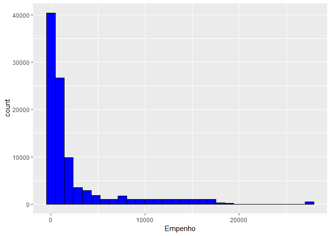
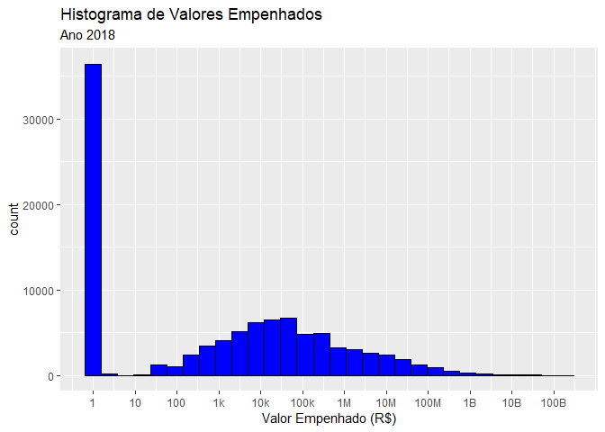
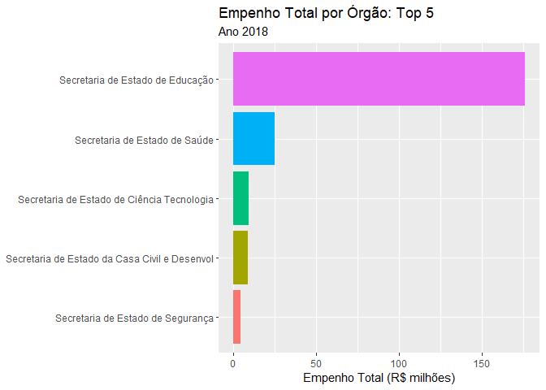
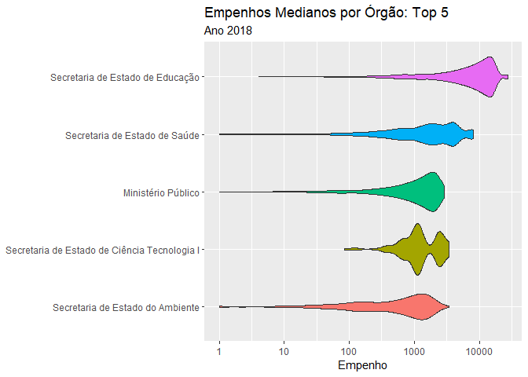

Execução Orçamentária: Análise do Empenho
================

Inclusão de pacotes

``` r
library(tidyverse)
library(fs)
```

Checa tamanho dos arquivos

``` r
dir_info("data") %>% select(path,size,modification_time)
```

    ## # A tibble: 5 x 3
    ##   path                                 size modification_time  
    ##   <fs::path>                    <fs::bytes> <dttm>             
    ## 1 data/despesa.zip                  125.32M 2019-03-29 07:40:36
    ## 2 data/despesa2018.csv              301.04M 2019-03-29 18:05:13
    ## 3 data/despesa2018.zip               17.98M 2019-03-29 16:40:21
    ## 4 data/despesa2018_squished.csv      49.34M 2019-03-29 18:06:40
    ## 5 data/despesa2018_squished.zip       9.08M 2019-03-29 19:43:56

# Leitura de Dados Higienizados

Colocar num data frame (“tibble”). Nota: arquivo agora ’e UTF-8

``` r
fname_2018_squished_zip <- "data/despesa2018_squished.zip"
df_orcamento <- read_delim(fname_2018_squished_zip,delim=";",
                           quote="'") # evita erro com "
```

    ## Parsed with column specification:
    ## cols(
    ##   .default = col_character(),
    ##   Poder = col_double(),
    ##   Grupo = col_double(),
    ##   `Nome Grupo` = col_logical(),
    ##   `Modalidade de Aplicação` = col_double(),
    ##   Elemento = col_double(),
    ##   `Sub Elemento` = col_double(),
    ##   Empenho = col_double(),
    ##   `Valor Empenhado` = col_number(),
    ##   `Valor Liquidado` = col_number(),
    ##   `Valor Pago` = col_number()
    ## )

    ## See spec(...) for full column specifications.

``` r
glimpse(df_orcamento)
```

    ## Observations: 99,362
    ## Variables: 32
    ## $ Poder                          <dbl> 1, 1, 1, 1, 1, 1, 1, 1, 1, 1, 1...
    ## $ `Nome Poder`                   <chr> "Executivo", "Executivo", "Exec...
    ## $ Grupo                          <dbl> 3, 3, 3, 3, 3, 3, 3, 3, 3, 3, 3...
    ## $ `Nome Grupo`                   <lgl> NA, NA, NA, NA, NA, NA, NA, NA,...
    ## $ `Modalidade de Aplicação`      <dbl> 90, 90, 90, 90, 90, 90, 90, 90,...
    ## $ `Nome Modalidade de Aplicação` <chr> "Aplicações Diretas", "Aplicaçõ...
    ## $ Elemento                       <dbl> 339036, 339014, 339039, 339030,...
    ## $ `Nome Elemento`                <chr> "Outros Serviços de Terceiros -...
    ## $ `Sub Elemento`                 <dbl> NA, NA, NA, NA, NA, NA, NA, NA,...
    ## $ `Nome Sub Elemento`            <chr> NA, NA, NA, NA, NA, NA, NA, NA,...
    ## $ Órgão                          <chr> "21", "31", "29", "21", "40", "...
    ## $ `Nome Órgão`                   <chr> "Secretaria de Estado da Casa C...
    ## $ UO                             <chr> "2133", "3131", "2961", "2104",...
    ## $ `Nome UO`                      <chr> "Departamento de Trânsito do Es...
    ## $ UG                             <chr> "263100", "053100", "296100", "...
    ## $ `Nome UG`                      <chr> "DEPARTAMENTO DE TRANSITO DO RI...
    ## $ Credor                         <chr> "965.197.977-15", "042.670.427-...
    ## $ `Nome Credor`                  <chr> "ALEXANDRE CESAR DE SOUZA", "LU...
    ## $ `Fonte de Recursos`            <chr> "32", "12", "22", "00", "00", "...
    ## $ `Nome Fonte de Recursos`       <chr> "Taxas pelo Exercício do Poder ...
    ## $ Processo                       <chr> "E-12/061/7244/20", "E-12/171/1...
    ## $ Função                         <chr> "06", "22", "10", "04", "13", "...
    ## $ `Nome Função`                  <chr> "Segurança Pública", "Indústria...
    ## $ `Sub Função`                   <chr> "122", "122", "302", "122", "12...
    ## $ `Nome Sub Função`              <chr> "Administração Geral", "Adminis...
    ## $ Licitação                      <chr> "05", "07", "09", "09", "05", "...
    ## $ `Nome Licitação`               <chr> "DISPENSA", "NAO APLICAVEL", "P...
    ## $ Empenho                        <dbl> 4390, 1354, 7927, 561, 752, 140...
    ## $ Histórico                      <chr> "Cancelamento conforme Decreto ...
    ## $ `Valor Empenhado`              <dbl> 0, 0, 0, 0, 0, 0, 0, 0, 0, 0, 0...
    ## $ `Valor Liquidado`              <dbl> 0, 0, 0, 0, 0, 0, 0, 0, 0, 0, 0...
    ## $ `Valor Pago`                   <dbl> 0, 0, 0, 0, 0, 0, 0, 0, 0, 0, 0...

``` r
problems(df_orcamento)
```

    ## # tibble [0 x 4]
    ## # ... with 4 variables: row <int>, col <int>, expected <chr>, actual <chr>

Quantas linhas, colunas, ou dimensões?

``` r
nrow(df_orcamento)
```

    ## [1] 99362

``` r
ncol(df_orcamento)
```

    ## [1] 32

``` r
dim(df_orcamento)
```

    ## [1] 99362    32

# Análise do “Empenho”

Calcula sumarização de colunas que parecem conter valores:

``` r
summary(df_orcamento%>%select(contains("empenh"),
                              contains("valor")))
```

    ##     Empenho      Valor Empenhado     Valor Liquidado    
    ##  Min.   :    1   Min.   :0.000e+00   Min.   :0.000e+00  
    ##  1st Qu.:  236   1st Qu.:0.000e+00   1st Qu.:0.000e+00  
    ##  Median :  659   Median :2.588e+03   Median :1.254e+03  
    ##  Mean   : 2475   Mean   :3.747e+07   Mean   :3.768e+07  
    ##  3rd Qu.: 2085   3rd Qu.:9.188e+04   3rd Qu.:7.438e+04  
    ##  Max.   :27484   Max.   :1.930e+11   Max.   :1.930e+11  
    ##    Valor Pago       
    ##  Min.   :0.000e+00  
    ##  1st Qu.:0.000e+00  
    ##  Median :2.750e+02  
    ##  Mean   :3.315e+07  
    ##  3rd Qu.:4.694e+04  
    ##  Max.   :1.930e+11

Quantas linhas não preenchidas (com ‘NA’)?

``` r
df_orcamento$Empenho %>% is.na %>% sum
```

    ## [1] 0

Plota histograma do Empenho

``` r
df_orcamento %>% ggplot(aes(Empenho)) +
  geom_histogram(bins=30,fill="blue",color="black")
```

<!-- -->

Aplica “log” no valor:

``` r
df_orcamento %>% ggplot(aes(Empenho)) +
  geom_histogram(bins=30,fill="blue",color="black") +
  scale_x_log10()
```

<!-- -->

Estudo dos Órgãos

``` r
df_orcamento %>% count(`Órgão`,`Nome Órgão`)
```

    ## # A tibble: 27 x 3
    ##    Órgão `Nome Órgão`                                      n
    ##    <chr> <chr>                                         <int>
    ##  1 01    Assembléia Legislativa                          730
    ##  2 02    Tribunal de Contas do Estado do Rio de Janeir  1385
    ##  3 03    Tribunal de Justiça do Estado do Rio de Janei  2436
    ##  4 07    Secretaria de Estado de Obras                  4671
    ##  5 08    Vice-Governadoria                                93
    ##  6 09    Procuradoria Geral do Estado                   1636
    ##  7 10    Ministério Público                             2629
    ##  8 11    Defensoria Pública Geral do Estado             1163
    ##  9 13    Secretaria de Estado de Agricultura Pecuária   4800
    ## 10 14    Secretaria de Estado de Governo                 678
    ## # ... with 17 more rows

Ordenando pelo mais frequente

``` r
df_orcamento %>% count(`Órgão`,`Nome Órgão`,sort=T)
```

    ## # A tibble: 27 x 3
    ##    Órgão `Nome Órgão`                                      n
    ##    <chr> <chr>                                         <int>
    ##  1 18    Secretaria de Estado de Educação              19940
    ##  2 40    Secretaria de Estado de Ciência Tecnologia    12816
    ##  3 29    Secretaria de Estado de Saúde                 11056
    ##  4 21    Secretaria de Estado da Casa Civil e Desenvol 10603
    ##  5 26    Secretaria de Estado de Segurança              5542
    ##  6 13    Secretaria de Estado de Agricultura Pecuária   4800
    ##  7 07    Secretaria de Estado de Obras                  4671
    ##  8 20    Secretaria de Estado de Fazenda e Planejament  4192
    ##  9 31    Secretaria de Estado de Transportes            3436
    ## 10 10    Ministério Público                             2629
    ## # ... with 17 more rows

Empenho por órgão:

``` r
df_orcamento %>%
  group_by(`Nome Órgão`) %>%
  summarize(n=n(),
            total=sum(Empenho),
            media=mean(Empenho),
            mediana=median(Empenho),
            desvio_padrao=sd(Empenho),
            mad=mad(Empenho)) %>%
  arrange(-total)
```

    ## # A tibble: 27 x 7
    ##    `Nome Órgão`                 n   total media mediana desvio_padrao   mad
    ##    <chr>                    <int>   <dbl> <dbl>   <dbl>         <dbl> <dbl>
    ##  1 Secretaria de Estado de~ 19940  1.76e8 8837.   8546.         6089. 7346.
    ##  2 Secretaria de Estado de~ 11056  2.50e7 2257.   1668.         2086. 1817.
    ##  3 Secretaria de Estado de~ 12816  9.15e6  714.    483           712.  506.
    ##  4 Secretaria de Estado da~ 10603  8.48e6  800.    413          1013.  430.
    ##  5 Secretaria de Estado de~  5542  4.40e6  795.    623           640.  623.
    ##  6 Secretaria de Estado de~  4671  4.03e6  862.    539           800.  652.
    ##  7 Ministério Público        2629  3.27e6 1243.   1231           776.  979.
    ##  8 Secretaria de Estado do~  2565  1.98e6  773.    670           638.  802.
    ##  9 Secretaria de Estado de~  4192  1.83e6  436.    313           397.  317.
    ## 10 Secretaria de Estado de~  4800  1.78e6  371.    302           281.  310.
    ## # ... with 17 more rows

Empenho total por órgão: Top 5

``` r
df_orcamento %>%
  rename(orgao=`Nome Órgão`) %>%
  mutate(orgao=orgao%>%fct_reorder(-Empenho,sum)) %>%
  filter(as.integer(orgao)<6) %>%
  mutate(orgao=orgao%>%fct_rev) %>%
  group_by(orgao) %>%
  summarize(total=sum(Empenho)/10^6) %>%
  ggplot(aes(orgao,total)) +
  geom_col(aes(fill=orgao)) +
  coord_flip() +
  labs(title="Empenho Total por Órgão: Top 5",
       subtitle="Ano 2018",
       y="Empenho Total (R$ milhões)") +
  theme(legend.position = "none",
        axis.title.y=element_blank())
```

<!-- -->

Distribuição do Empenho por Órgão (boxbplot)

``` r
df_orcamento %>%
  rename(orgao=`Nome Órgão`) %>%
  mutate(orgao=orgao%>%fct_reorder(-Empenho)) %>%
  filter(as.integer(orgao)<6) %>%
  mutate(orgao=orgao%>%fct_rev) %>%
  ggplot(aes(orgao,Empenho)) +
  geom_boxplot(aes(fill=orgao),notch=T) +
  scale_y_log10() +
  coord_flip() +
  labs(title="Empenhos Medianos por Órgão: Top 5",
       subtitle="Ano 2018") +
  theme(legend.position = "none",
        axis.title.y=element_blank())
```

<!-- -->

Distribuição do Empenho por Órgão (violin plot)

``` r
df_orcamento %>%
  rename(orgao=`Nome Órgão`) %>%
  mutate(orgao=orgao%>%fct_reorder(-Empenho)) %>%
  filter(as.integer(orgao)<6) %>%
  mutate(orgao=orgao%>%fct_rev) %>%
  ggplot(aes(orgao,Empenho)) +
  geom_violin(aes(fill=orgao)) +
  scale_y_log10() +
  coord_flip() +
  labs(title="Empenhos Medianos por Órgão: Top 5",
       subtitle="Ano 2018") +
  theme(legend.position = "none",
        axis.title.y=element_blank())
```

<!-- -->
