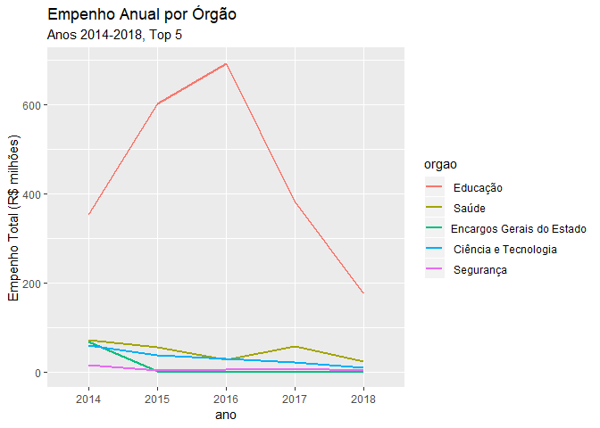
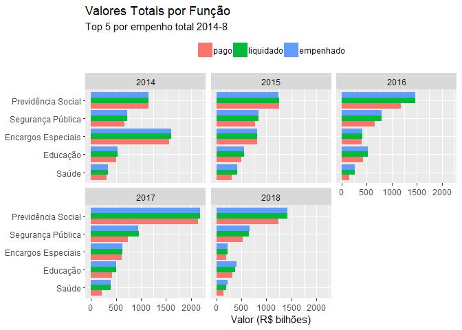
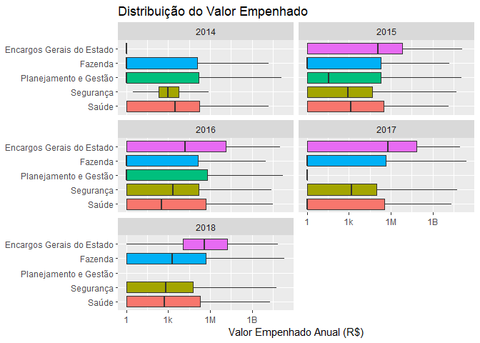
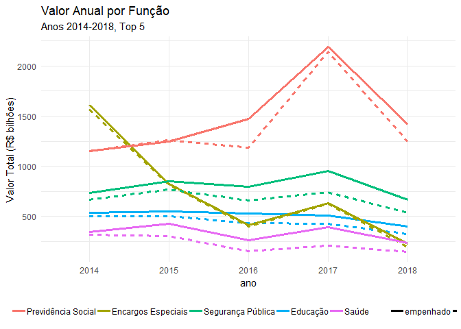

Empenho: Análise dos Dados, 2014-8
================

Inclusão de pacotes

``` r
library(tidyverse)
#> Warning: package 'tidyverse' was built under R version 3.5.3
#> Warning: package 'tibble' was built under R version 3.5.3
#> Warning: package 'tidyr' was built under R version 3.5.3
#> Warning: package 'readr' was built under R version 3.5.3
#> Warning: package 'purrr' was built under R version 3.5.3
#> Warning: package 'dplyr' was built under R version 3.5.3
#> Warning: package 'stringr' was built under R version 3.5.3
#> Warning: package 'forcats' was built under R version 3.5.3
library(ggthemes)
#> Warning: package 'ggthemes' was built under R version 3.5.3
library(ggforce)
#> Warning: package 'ggforce' was built under R version 3.5.3
```

Lê do arquivo “.rds” preparado em `preparo_anos.Rmd`

``` r
df_all <- read_rds("data/df_all.rds")
nrow(df_all)
#> [1] 705527
```

Renomeia e seleciona colunas a serem utilizadas

``` r
df_all_clean <- df_all %>%
  # era: rename(), select() deixa df menor
  select(ano,
         func_cod=`Função`,
         func=`Nome Função`,
         empenhado=`Valor Empenhado`,
         liquidado=`Valor Liquidado`,
         pago=`Valor Pago`)
```

Nomes das funções são únicas por código?

``` r
df_all_clean %>%
  count(func_cod,func) %>%
  count(func_cod,name="nn") %>%
  count(nn)
#> # A tibble: 1 x 2
#>      nn     n
#>   <int> <int>
#> 1     1    25
```

Função com maior valor empenhado total (top 5)

``` r
anos <- unique(df_all_clean$ano%>%as.character)%>%as.integer

df_top_funcs_empenhado <- df_all_clean %>%
  group_by(func_cod,func) %>%
  summarize(n=n(),
            total=sum(empenhado)) %>%
  arrange(desc(total)) %>%
  head(5) %>%
  select(func_cod,func,everything()) %>%
  ungroup() %>%
  mutate_at(vars(func_cod,func),fct_drop) %>% # so unused levels are dropped
  mutate(media_anual=total/length(anos)) %>%
  mutate_at(vars(total,media_anual),~(./10^9)%>%as.integer) %>%
  rename_at(vars(total,media_anual),~str_c(.,"_b")) # billions
df_top_funcs_empenhado
#> # A tibble: 5 x 5
#>   func_cod func                    n total_b media_anual_b
#>   <fct>    <fct>               <int>   <int>         <int>
#> 1 09       Previdência Social  11506    7478          1495
#> 2 06       Segurança Pública   77487    3991           798
#> 3 28       Encargos Especiais  15356    3696           739
#> 4 12       Educação           235933    2520           504
#> 5 10       Saúde               78066    1644           328
```

Valores médios anuais

``` r
df_top_funcs_empenhado %>%
  mutate(func=func%>%fct_inorder()%>%fct_rev) %>%
  ggplot(aes(func,media_anual_b)) +
  geom_col(aes(fill=func)) +
  coord_flip() +
  labs(title="Média de Valores Empenhados Anuais por Função",
       subtitle=sprintf("Anos %s-%s, Top 5", min(anos),max(anos)),
       y="Valor Empenhado Anual Médio (R$ bilhões)") +
  theme(legend.position = "none",
        axis.title.y=element_blank())
```

<!-- -->

``` r
df_all_clean %>%
  mutate(func=func%>%fct_reorder(-empenhado,sum)) %>%
  filter(as.integer(func)<6) %>%
  mutate(func=func%>%fct_drop%>%fct_rev) %>% # for coord_flip
  group_by(ano,func) %>%
  # milhoes
  summarize_at(vars(empenhado,liquidado,pago),
               list(~(sum(.)/10^9))) %>%
  gather("key","value",-func,-ano) %>%
  mutate(key=factor(key,levels=c("pago","liquidado","empenhado"))) %>%
  ggplot(aes(func,value,group=key,fill=key)) +
  geom_col(position="dodge") +
  coord_flip() +
  labs(title="Valores Totais por Função",
       subtitle="Top 5 por empenho total 2014-8",
       y="Valor (R$ bilhões)") +
  theme(legend.position = "top",
        legend.title = element_blank(),
        axis.title.y=element_blank()) +
  facet_wrap(~ano)
```

<!-- -->

Empenhado vs Pago das top funções:

``` r
df_valores <- df_all_clean %>%
  # to avoid warning on factors
  {suppressWarnings(semi_join(.,df_top_funcs_empenhado,by="func_cod"))}%>%
  group_by(ano,func) %>%
  summarize_at(vars(empenhado,liquidado,pago),list(sum=~sum(.)/10^9%>%round(1))) %>%
  arrange(desc(empenhado_sum)) %>%
  ungroup() %>% # para q proxima linha rode corretamente
  mutate(func=func%>%fct_drop%>%fct_inorder) %>%
  gather("tipo","valor",ends_with("_sum")) %>%
  mutate_at(vars(tipo),~str_sub(.,end=-5)) %>% # remove "_sum" suffix
  filter(tipo!="liquidado")

df_valores %>%
  ggplot(aes(ano,valor,group=func,color=func)) +
  geom_line(size=I(1.2)) +
  # scale_y_log10() +
  labs(title="Valor Anual por Função",
       subtitle=sprintf("Anos %s-%s, Top 5", min(anos),max(anos)),
       y = "Valor Total (R$ bilhões)") +
  theme(legend.position = "top",
        legend.title=element_blank()) +
  facet_wrap(~tipo)
```

<!-- -->

Empenhado vs Pago das top funções:

``` r
df_valores_ggf <- df_valores%>%
  filter(tipo=="empenhado",ano==2017) %>%
  group_by(ano,func,tipo)%>%
  summarize(valor=last(valor))

df_valores %>%
  mutate(func_tipo=func%>%str_c("_",tipo)) %>%
  ggplot(aes(ano,valor,
             group=func_tipo,
             color=func,linetype=tipo)) +
  geom_line(size=I(1.2)) +
  # to do: ggforce
  # geom_mark_ellipse(aes(fill = Species, label = Species)) +
  #geom_mark_circle(aes(ano,valor,
  #                     label=func,
  #                     fill=func),
  #                 data=df_valores_ggf,
  #                 expand=.002,
  #                 label.fontsize=8,
  #                inherit.aes=F)+
  #scale_y_log10() +
  labs(title="Valor Anual por Função",
       subtitle=sprintf("Anos %s-%s, Top 5", min(anos),max(anos)),
       y = "Valor Total (R$ bilhões)") +
  theme_minimal() +
    theme(legend.position = "bottom",
          legend.title=element_blank())
```

<!-- -->

``` r
ggsave("pics/empenhado vs pago.png",width=11)
#> Saving 11 x 5 in image
```

### TO DO: use ggforce::geom\_mark

<https://www.data-imaginist.com/2019/the-ggforce-awakens-again/>

Distribuição de Valor Empenhado por ano (faceteamento)

``` r
df_all_clean %>%
  semi_join(df_top_funcs_empenhado,by="func_cod") %>%
  mutate(func=func%>%fct_reorder(empenhado,sum)) %>%
  ggplot(aes(func,empenhado+1)) +
  geom_boxplot(aes(fill=func),outlier.shape=NA) +
  scale_y_log10(breaks=10^c(0,3,6,9),labels=c("1","1k","1M","1B")) + #breaks=10^(1:5),labels=10^(1:5)%>%as.integer) +
  coord_flip() + # ylim=c(10,.5*10^5)) +
  facet_wrap(~ano,ncol=2) +
  labs(title="Distribuição do Valor Empenhado",
       y = "Valor Empenhado Anual (R$)") +
  theme(legend.position = "none",
        axis.title.y=element_blank())
#> Warning: Column `func_cod` joining factors with different levels, coercing
#> to character vector
```

<!-- -->
