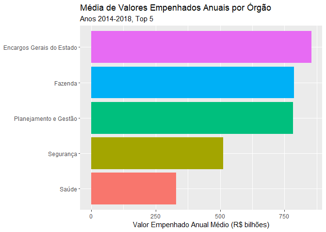

Empenho: Série Histórica
================

Inclusão de pacotes

``` r
library(tidyverse)
```

Lê do arquivo “.rds” preparado em `preparo_anos.Rmd`

``` r
df_all <- read_rds("data/df_all.rds")
nrow(df_all)
```

    ## [1] 705527

Limpa nome de orgao de maneira mais genérica

``` r
clean_orgao_gen <- function(orgao) orgao %>%
  str_remove_all("[^[:alpha:]\\s]") %>%
  str_remove_all("Sec(ret|retaria)? ?d[aeo] Est(ado)? (d[aeo])?") %>%
  str_remove_all("Sec Est de ")
  #str_remove("^Sec(retaria|ret)?\\.? ?d[aeo] Est.?(ado)? d[aeo] ?")
```

Cria tabela de referência p/ nomes de órgãos (usa o primeiro a aparecer)

``` r
df_orgao_ref <- df_all %>%
  rename(orgao_cod=`Órgão`,
         orgao=`Nome Órgão`) %>%
  mutate(orgao=orgao%>%as.character) %>% # era fatir
  group_by(orgao_cod) %>%
  summarize(n=n(),orgao_list=list(orgao)) %>%
  mutate(orgao_ref=map_chr(orgao_list,first)) %>%
  select(orgao_cod,orgao_ref) %>%
  mutate(orgao_ref=orgao_ref%>%clean_orgao_gen) %>%
  arrange(orgao_cod)
df_orgao_ref
```

    ## # A tibble: 34 x 2
    ##    orgao_cod orgao_ref                         
    ##    <fct>     <chr>                             
    ##  1 01        Assembléia Legislativa            
    ##  2 02        Tribunal de Contas do Estado do RJ
    ##  3 03        Tribunal de Justiça               
    ##  4 07        " Obras"                          
    ##  5 08        ViceGovernadoria                  
    ##  6 09        Procuradoria Geral do Estado      
    ##  7 10        Ministério Público                
    ##  8 11        Defensoria Pública Geral do Estado
    ##  9 12        " Planejamento e Gestão"          
    ## 10 13        " Agricultura e Pecuária"         
    ## # ... with 24 more rows

Órgãos com maior empenho total (top 5)

``` r
anos <- unique(df_all$ano%>%as.character)%>%as.integer

df_all_top_orgaos_empenho <- df_all %>%
  rename(orgao_cod=`Órgão`) %>%
  group_by(orgao_cod) %>%
  summarize(n=n(),total=sum(Empenho)) %>%
  arrange(desc(total)) %>%
  head(5) %>%
  inner_join(df_orgao_ref,by="orgao_cod") %>%
  select(orgao_cod,orgao_ref,everything()) %>%
  mutate(media_anual=total/length(anos))
df_all_top_orgaos_empenho
```

    ## # A tibble: 5 x 5
    ##   orgao_cod orgao_ref                      n      total media_anual
    ##   <fct>     <chr>                      <int>      <dbl>       <dbl>
    ## 1 18        " Educação"               155203 2208575029  441715006.
    ## 2 29        " Saúde"                   77625  242259450   48451890 
    ## 3 40        " Ciência e Tecnologia"    93202  161507216   32301443.
    ## 4 37        Encargos Gerais do Estado  19223   72845941   14569188.
    ## 5 26        " Segurança"               38427   39831177    7966235.

Plota médias anuais

``` r
df_all_top_orgaos_empenho%>%
  mutate(orgao_ref=orgao_ref%>%fct_inorder()%>%fct_rev)%>%
  ggplot(aes(orgao_ref,media_anual/10^6)) +
  geom_col(aes(fill=orgao_ref)) +
  coord_flip() +
  labs(title="Média de Empenhos Anuais por Órgão",
       subtitle=sprintf("Anos %s-%s, Top 5", min(anos),max(anos)),
       y="Empenho Anual Médio (R$ milhões)") +
  theme(legend.position = "none",
        axis.title.y=element_blank())
```

<!-- -->

Evolução história do empenho destes top órgãos:

``` r
df_all %>%
  rename(orgao_cod=`Órgão`) %>%
  inner_join(df_all_top_orgaos_empenho%>%
               select(orgao_cod,orgao=orgao_ref),
             by="orgao_cod") %>%
  group_by(ano,orgao) %>%
  summarize(total=sum(Empenho)/10^6) %>%
  arrange(desc(total)) %>%
  mutate(orgao=orgao%>%fct_inorder) %>%
  ggplot(aes(ano,total,group=orgao,color=orgao)) +
  geom_line(size=I(1)) +
  # scale_y_log10() +
  labs(title="Empenho Anual por Órgão",
       subtitle=sprintf("Anos %s-%s, Top 5", min(anos),max(anos)),
       y = "Empenho Total (R$ milhões)")
```

<!-- -->

Com log-scale:

``` r
df_all %>%
  rename(orgao_cod=`Órgão`) %>%
  inner_join(df_all_top_orgaos_empenho%>%
               select(orgao_cod,orgao=orgao_ref),
             by="orgao_cod") %>%
  group_by(ano,orgao) %>%
  summarize(total=sum(Empenho)/10^6) %>%
  mutate(orgao=orgao%>%fct_reorder(total,sum)%>%fct_rev) %>%
  ggplot(aes(ano,total,group=orgao,color=orgao)) +
  geom_line(size=I(1)) +
  scale_y_log10() +
  labs(title="Empenho Anual por Órgão",
       subtitle=sprintf("Anos %s-%s, Top 5", min(anos),max(anos)),
       y = "Empenho Total (R$ milhões)") +
  theme(legend.position = "bottom",
        legend.title = element_blank())
```

<!-- -->

Distribuição de empenho por ano (faceteamento)

``` r
df_all %>%
  rename(orgao_cod=`Órgão`) %>%
  inner_join(df_all_top_orgaos_empenho%>%
               select(orgao_cod,orgao=orgao_ref),
             by="orgao_cod") %>%
  mutate(orgao=orgao%>%fct_reorder(Empenho,sum)) %>%
  ggplot(aes(orgao,Empenho)) +
  geom_boxplot(aes(fill=orgao),outlier.shape=NA) +
  scale_y_log10(breaks=10^(1:5),labels=10^(1:5)%>%as.integer) +
  coord_flip(ylim=c(10,.5*10^5)) +
  facet_wrap(~ano,ncol=2) +
  labs(title="Distribuição do Empenho por Ano",
       y = "Empenho Anual") +
  theme(legend.position = "none",
        axis.title.y=element_blank())
```

<!-- -->
