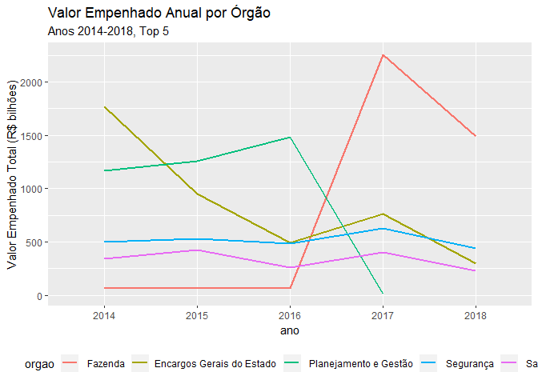

Empenho: Análise dos Dados, 2014-8
================

Inclusão de pacotes

``` r
library(tidyverse)
```

Lê do arquivo “.rds” preparado em `preparo_anos.Rmd`

``` r
df_all <- read_rds("data/df_all.rds")
nrow(df_all)
#> [1] 705527
```

Renomeia e seleciona colunas a serem utilizadas

``` r
df_all_clean <- df_all %>%
  # era: rename(), select() deixa df menor
  select(ano,
         func_cod=`Função`,
         func=`Nome Função`,
         empenhado=`Valor Empenhado`,
         liquidado=`Valor Liquidado`,
         pago=`Valor Pago`)
```

Nomes das funções são únicas por código?

``` r
df_all_clean %>%
  count(func_cod,func) %>%
  count(func_cod) %>%
  count(nn)
#> # A tibble: 1 x 2
#>      nn     n
#>   <int> <int>
#> 1     1    25
```

Função com maior valor empenhado total (top 5)

``` r
anos <- unique(df_all_clean$ano%>%as.character)%>%as.integer

df_top_funcs_empenhado <- df_all_clean %>%
  group_by(func_cod,func) %>%
  summarize(n=n(),
            total=sum(empenhado)) %>%
  arrange(desc(total)) %>%
  head(5) %>%
  select(func_cod,func,everything()) %>%
  ungroup() %>%
  mutate_at(vars(func_cod,func),fct_drop) %>% # so unused levels are dropped
  mutate(media_anual=total/length(anos)) %>%
  mutate_at(vars(total,media_anual),~(./10^9)%>%as.integer) %>%
  rename_at(vars(total,media_anual),~str_c(.,"_b")) # billions
df_top_funcs_empenhado
#> # A tibble: 5 x 5
#>   func_cod func                    n total_b media_anual_b
#>   <fct>    <fct>               <int>   <int>         <int>
#> 1 09       Previdência Social  11506    7478          1495
#> 2 06       Segurança Pública   77487    3991           798
#> 3 28       Encargos Especiais  15356    3696           739
#> 4 12       Educação           235933    2520           504
#> 5 10       Saúde               78066    1644           328
```

Valores médios anuais

``` r
df_top_funcs_empenhado %>%
  mutate(func=func%>%fct_inorder()%>%fct_rev) %>%
  ggplot(aes(func,media_anual_b)) +
  geom_col(aes(fill=func)) +
  coord_flip() +
  labs(title="Média de Valores Empenhados Anuais por Função",
       subtitle=sprintf("Anos %s-%s, Top 5", min(anos),max(anos)),
       y="Valor Empenhado Anual Médio (R$ bilhões)") +
  theme(legend.position = "none",
        axis.title.y=element_blank())
```

<!-- -->

Evolução história dos Valores Empenhados destes top funçãos:

``` r
df_hist <- df_all_clean %>%
  semi_join(df_top_funcs_empenhado,by="func_cod") %>%
  group_by(ano,func) %>%
  summarize(total_b=sum(empenhado)/10^9) %>%
  arrange(desc(total_b)) %>%
  ungroup() %>% # para q proxima linha rode corretamente
  mutate(func=func%>%fct_drop%>%fct_inorder) #
#> Warning: Column `func_cod` joining factors with different levels, coercing
#> to character vector
```

Grafa o histórico:

``` r
df_hist %>%
  ggplot(aes(ano,total_b,group=func,color=func)) +
  geom_line(size=I(1)) +
  # scale_y_log10() +
  labs(title="Valor Empenhado Anual por Função",
       subtitle=sprintf("Anos %s-%s, Top 5", min(anos),max(anos)),
       y = "Valor Empenhado Total (R$ bilhões)") +
  theme(legend.position = "bottom",
        legend.title=element_blank())
```

<!-- -->

Distribuição de Valor Empenhado por ano (faceteamento)

``` r
df_all_clean %>%
  semi_join(df_top_funcs_empenhado,by="func_cod") %>%
  mutate(func=func%>%fct_reorder(empenhado,sum)) %>%
  ggplot(aes(func,empenhado+1)) +
  geom_boxplot(aes(fill=func),outlier.shape=NA) +
  scale_y_log10(breaks=10^c(0,3,6,9),labels=c("1","1k","1M","1B")) + #breaks=10^(1:5),labels=10^(1:5)%>%as.integer) +
  coord_flip() + # ylim=c(10,.5*10^5)) +
  facet_wrap(~ano,ncol=2) +
  labs(title="Distribuição do Valor Empenhado",
       y = "Valor Empenhado Anual (R$)") +
  theme(legend.position = "none",
        axis.title.y=element_blank())
#> Warning: Column `func_cod` joining factors with different levels, coercing
#> to character vector
```

<!-- -->
